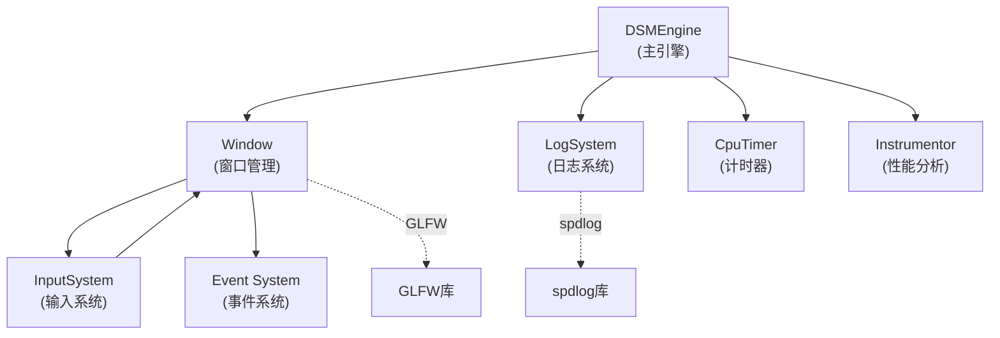
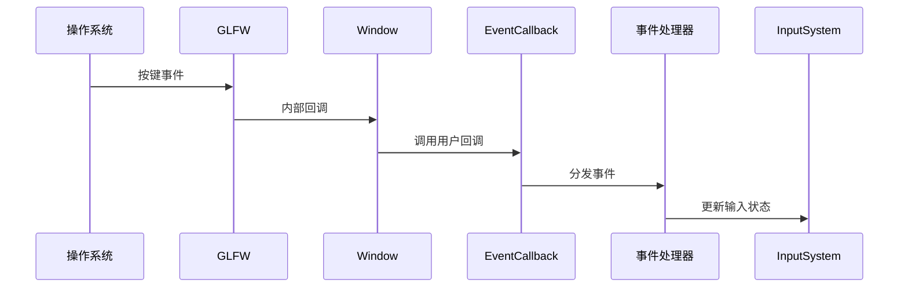

# DSMEngine Runtime/Core 模块分析文档

## 文档概述

本文档详细分析 DSMEngine 的 **Runtime/Core** 模块，这是整个引擎的基础核心系统。该模块负责引擎的初始化、窗口管理、输入处理、日志输出和性能分析等基础功能。

---

## 1. 代码结构与组织方式

### 1.1 目录结构

```
DSMEngine/Runtime/Core/
├── CpuTimer.h                  # CPU 计时器（帧时间计算）
├── CpuTimer.cpp
├── DSMEngine.h                 # 引擎主类头文件
├── DSMEngine.cpp              # 引擎主类实现
├── LogSystem.h                # 日志系统
├── LogSystem.cpp              # 日志系统实现
├── Window.h                   # 窗口管理
├── Window.cpp                 # 窗口实现
├── Macro.h                    # 宏定义（断言等）
├── PlatformDetection.h        # 平台检测
├── InstrumentorTimer.h        # 性能分析计时器
├── InstrumentorMacro.h        # 性能分析宏
├── Input/
│   ├── InputSystem.h          # 输入系统
│   ├── InputSystem.cpp
│   ├── KeyCodes.h             # 键盘键码定义
│   └── MouseCodes.h           # 鼠标键码定义
└── [Event/]                   # 事件系统（在Event模块中）
```

### 1.2 文件命名规范

| 类型 | 命名规范 | 示例 |
|------|--------|------|
| 头文件 | `PascalCase.h` | `LogSystem.h` |
| 实现文件 | `PascalCase.cpp` | `LogSystem.cpp` |
| 平台相关 | 保持一致 | `PlatformDetection.h` |
| 类名 | `PascalCase` | `class LogSystem` |
| 成员变量 | `m_camelCase` | `m_LogFunc` |
| 常量 | `UPPER_SNAKE_CASE` | `c_InvalidObjectID` |

### 1.3 逻辑组织方式

Core 模块采用**模块化设计**，各组件功能独立但相互协作：

```
DSMEngine(主引擎类)
    ├── Window(窗口管理)
    │   └── InputSystem(输入处理)
    ├── LogSystem(日志输出)
    ├── CpuTimer(帧时间计算)
    └── Instrumentor(性能分析)
```

每个组件都是独立的系统，可以单独初始化和销毁。

---

## 2. 核心功能与实现原理

### 2.1 模块使命

**Core 模块的核心职责：**

| 职责 | 描述 | 关键类 |
|------|------|--------|
| 引擎生命周期管理 | 初始化、运行、清理 | `DSMEngine` |
| 窗口与操作系统交互 | 创建窗口、事件分发 | `Window` |
| 输入设备管理 | 键盘、鼠标输入采集 | `InputSystem` |
| 日志输出与管理 | 分级日志记录 | `LogSystem` |
| 性能测量与分析 | 帧时间、函数耗时 | `CpuTimer`、`Instrumentor` |

### 2.2 核心设计模式

#### 2.2.1 Singleton 模式（单例）

**应用场景：**
- `LogSystem` - 全局日志输出
- `Instrumentor` - 性能分析记录器

```cpp
// Instrumentor 的单例实现
static Instrumentor& GetInstance() {
    static Instrumentor instance;  // 线程安全的静态初始化
    return instance;
}

// 使用方式
Instrumentor::BeginSession("ProfileSession");
// ... 代码执行 ...
Instrumentor::EndSession();
```

**优点：**
- 全局唯一访问点
- 线程安全（C++11 static 初始化）

**缺点：**
- 难以测试和模拟
- 隐藏依赖关系

#### 2.2.2 事件观察者模式（Event Observer）

**应用场景：** 窗口事件分发

```cpp
class Window {
    using EventCallbackFunc = std::function<void(Event&)>;
    void SetEventCallback(const EventCallbackFunc& func);
};

// 使用方式
window.SetEventCallback([](Event& e) {
    if (KeyPressedEvent* keyEvent = dynamic_cast<KeyPressedEvent*>(&e)) {
        HandleKeyPress(*keyEvent);
    }
});
```

#### 2.2.3 资源获取即初始化（RAII）

**应用场景：** 性能计时

```cpp
class InstrumentationTimer {
public:
    InstrumentationTimer(const char* name) {
        m_StartTimepoint = std::chrono::high_resolution_clock::now();
    }
    
    ~InstrumentationTimer() {  // 自动停止计时
        if (!m_Stopped) Stop();
    }
};

// 使用方式（自动计时整个作用域）
{
    InstrumentationTimer timer("FunctionName");
    // 代码执行
}  // 离开作用域时自动计时并记录
```

### 2.3 关键技术选型

| 技术 | 选择 | 原因 | 替代方案 |
|------|------|------|---------|
| 窗口库 | GLFW | 跨平台、轻量、活跃社区 | SDL2、Win32 API |
| 日志库 | spdlog | 高性能、支持多线程 | Boost.Log、自实现 |
| 计时 | std::chrono | 标准库、精度高 | QueryPerformanceCounter |
| 性能分析 | JSON 输出 | Chrome DevTools 兼容 | VTune、自定义格式 |

---

## 3. 关键类、函数及其作用

### 3.1 DSMEngine 类

**职责：** 引擎主控制器，协调所有子系统

```cpp
class DSMEngine {
public:
    // 初始化引擎
    void StartEngine();
    
    // 主循环
    void Update();
    
    // 清理资源
    void Shutdown();
    
    // 获取子系统
    Window* GetWindow();
    LogSystem* GetLogSystem();
    GraphicsRenderer* GetRenderer();
    Scene* GetScene();
    
private:
    std::unique_ptr<Window> m_Window;
    std::unique_ptr<LogSystem> m_LogSystem;
    std::unique_ptr<GraphicsRenderer> m_Renderer;
    std::unique_ptr<Scene> m_Scene;
    CpuTimer m_Timer;
    bool m_Running = false;
};

// 全局引擎上下文
struct EngineGlobalContext {
    DSMEngine* engine;
    Window* window;
    LogSystem* logSystem;
    GraphicsRenderer* renderer;
    Scene* scene;
    InputSystem* inputSystem;
};

// 全局访问点
extern EngineGlobalContext sm_GlobalContext;
```

**核心方法说明：**

| 方法 | 功能 | 返回值 |
|------|------|--------|
| `StartEngine()` | 初始化所有子系统 | `void` |
| `Update()` | 单帧更新循环 | `void` |
| `Shutdown()` | 清理所有资源 | `void` |
| `GetWindow()` | 获取窗口对象 | `Window*` |
| `GetRenderer()` | 获取渲染器 | `GraphicsRenderer*` |

### 3.2 Window 类

**职责：** 操作系统窗口的抽象和管理

```cpp
struct WindowProps {
    std::string m_Title = "DSMEngine";
    uint32_t m_Width = 1600;
    uint32_t m_Height = 1024;
};

class Window {
public:
    using EventCallbackFunc = std::function<void(Event&)>;
    
    // 构造函数
    Window(const WindowProps& desc);
    ~Window();
    
    // 获取窗口属性
    uint32_t GetWidth() const;
    uint32_t GetHeight() const;
    const std::string& GetTitle() const;
    
    // 设置窗口属性
    void SetTitle(const std::string& title);
    void SetVSync(bool enabled);
    bool IsVSync() const;
    
    // 事件分发
    void SetEventCallback(const EventCallbackFunc& func);
    
    // 更新窗口状态
    void Update();
    
    // 查询窗口状态
    bool IsMinimized() const;
    bool IsFullScreen() const;
    
    // 文件拖放支持
    std::vector<std::filesystem::path> ConsumeDroppedPaths();
    
    // 获取原生 GLFW 窗口
    GLFWwindow* GetNativeWindow() const;
    
private:
    GLFWwindow* m_Window;
    struct WindowData {
        uint32_t width, height;
        bool VSync = false;
        EventCallbackFunc callback;
        std::string title;
        std::vector<std::filesystem::path> droppedPaths{};
    } m_Desc;
};
```

**关键特性：**

| 特性 | 说明 | 示例 |
|------|------|------|
| 事件回调 | 异步事件分发 | `window.SetEventCallback(...)` |
| VSync 控制 | 垂直同步 | `window.SetVSync(true)` |
| 文件拖放 | 支持拖放文件 | `window.ConsumeDroppedPaths()` |
| 全屏查询 | 检查窗口状态 | `window.IsFullScreen()` |

### 3.3 LogSystem 类

**职责：** 多级别日志管理和输出

```cpp
class LogSystem {
public:
    enum LogLevel {
        Debug,    // 调试信息
        Trace,    // 追踪信息
        Info,     // 普通信息
        Warn,     // 警告信息
        Error,    // 错误信息
        Fatal,    // 致命错误
        Count
    };
    
    using LogFunc = std::function<void(LogLevel, const std::string&)>;
    
    LogSystem();
    
    // 核心日志方法（模板函数，支持格式化字符串）
    template<typename... Args>
    void CoreLog(LogLevel level, std::string_view fmt, Args&&... args);
    
    template<typename... Args>
    void Log(LogLevel level, std::string_view fmt, Args&&... args);
    
    // 设置自定义日志回调
    void SetLogFunc(LogFunc&& logFunc);
    
    // 获取 spdlog 日志对象
    std::shared_ptr<spdlog::logger> GetCoreLogger();
    std::shared_ptr<spdlog::logger> GetClientLogger();
    
private:
    std::shared_ptr<spdlog::logger> m_CoreLogger;   // 引擎内部日志
    std::shared_ptr<spdlog::logger> m_ClientLogger;  // 应用程序日志
    LogFunc m_LogFunc;  // 用户自定义回调
};
```

**日志级别说明：**

| 级别 | 用途 | 颜色 |
|------|------|------|
| Debug | 调试信息（仅调试模式） | 灰色 |
| Trace | 详细追踪信息 | 白色 |
| Info | 普通信息 | 绿色 |
| Warn | 警告信息 | 黄色 |
| Error | 错误信息 | 红色 |
| Fatal | 致命错误 | 亮红 |

### 3.4 CpuTimer 类

**职责：** 计算帧时间和运行时间

```cpp
class CpuTimer {
public:
    CpuTimer();
    
    // 获取时间
    float TotalTime() const;  // 总运行时间（秒）
    float DeltaTime() const;  // 上一帧耗时（秒）
    
    // 控制计时
    void Reset();  // 重置计时器
    void Start();  // 开始计时
    void Stop();   // 暂停计时
    void Tick();   // 单帧计时（每帧调用一次）
    
private:
    double mSecondsPerCount;      // 每个计数单位的秒数
    double mDeltaTime;            // 上一帧耗时
    __int64 mBaseTime;            // 基准时间
    __int64 mPausedTime;          // 暂停累计时间
    __int64 mStopTime;            // 停止时间
    __int64 mPrevTime;            // 上一帧时间
    __int64 mCurrTime;            // 当前帧时间
    bool mStopped;                // 计时器是否暂停
};
```

**时间计算原理：**

```
总时间 = (当前时间 - 基准时间 - 暂停时间) / 频率
帧时间 = (当前帧时间 - 上一帧时间) / 频率
```

### 3.5 InputSystem 类

**职责：** 输入设备管理和输入查询

```cpp
class InputSystem {
public:
    InputSystem(Window* window);
    
    // 键盘输入查询
    bool IsKeyPressed(KeyCode keycode);
    
    // 鼠标输入查询
    bool IsMouseButtonPressed(MouseCode mouseCode);
    
    // 鼠标位置查询
    Math::Vector2 GetMousePosition();
    float GetMouseX();
    float GetMouseY();
    
private:
    Window* m_Window;  // 关联的窗口
};

// 键码定义示例（在 KeyCodes.h 中）
enum class KeyCode {
    Space = 32,
    Apostrophe = 39,
    Comma = 44,
    Minus = 45,
    Period = 46,
    // ... 更多键码 ...
    A = 65, B = 66, C = 67, // ... Z
    // ... 特殊键 ...
    Escape = 256,
    Enter = 257,
    Tab = 258,
    Backspace = 259,
    // ... 功能键等 ...
};

// 鼠标码定义（在 MouseCodes.h 中）
enum class MouseCode {
    Button0 = 0,  // 左键
    Button1 = 1,  // 右键
    Button2 = 2,  // 中键
    // ...
};
```

### 3.6 InstrumentationTimer 类（性能分析）

**职责：** 性能分析和分析数据收集

```cpp
struct ProfileResult {
    std::string Name;      // 函数/作用域名称
    long long Start;       // 开始时间（微秒）
    long long End;         // 结束时间（微秒）
    uint64_t ThreadID;     // 线程 ID
};

class Instrumentor {
public:
    // 开始分析会话
    static void BeginSession(const std::string& name, 
                           const std::string& filepath = "Results.json");
    
    // 结束分析会话
    static void EndSession();
    
    // 记录性能数据
    static void WriteProfile(const ProfileResult& result);
    
private:
    Instrumentor();  // 私有构造，单例模式
    static Instrumentor& GetInstance();
    
    std::ofstream m_OutputStream;
    std::mutex m_Lock;  // 线程同步
    bool m_ActiveSession;
};

class InstrumentationTimer {
public:
    InstrumentationTimer(const char* name);
    ~InstrumentationTimer();
    void Stop();
    
private:
    const char* m_Name;
    std::chrono::time_point<std::chrono::high_resolution_clock> m_StartTimepoint;
    bool m_Stopped;
};
```

---

## 4. 模块间的调用关系与接口定义

### 4.1 Core 模块依赖关系图



### 4.2 初始化流程

```
StartEngine()
  ├── LogSystem::Initialize()
  │   └── 创建日志输出到控制台和文件
  ├── Window::Create(WindowProps)
  │   ├── GLFW 初始化
  │   ├── 创建原生窗口
  │   └── 注册回调函数
  ├── InputSystem::Initialize(Window*)
  │   └── 存储窗口指针引用
  ├── GraphicsRenderer::Initialize()
  │   ├── D3D12 设备初始化
  │   └── 交换链创建
  └── Scene::Initialize()
      └── ECS 注册表创建
```

### 4.3 主循环流程

```
Update()
  ├── CpuTimer::Tick()
  │   ├── 计算 deltaTime
  │   └── 更新帧率信息
  ├── Window::Update()
  │   ├── GLFW 轮询事件
  │   └── 分发事件回调
  ├── Scene::Update(deltaTime)
  │   └── ECS 系统更新
  ├── GraphicsRenderer::Render()
  │   ├── 各渲染通道执行
  │   └── 图像输出
  └── Instrumentor::WriteProfile()
      └── 性能数据记录
```

### 4.4 事件分发流程



---

## 5. 依赖关系与数据流

### 5.1 外部依赖

| 依赖 | 版本 | 用途 | 位置 |
|------|------|------|------|
| **GLFW** | 3.x | 窗口和输入管理 | ThirdParty/glfw |
| **spdlog** | 1.x | 高性能日志 | ThirdParty/spdlog |
| **std::chrono** | C++11 | 精确计时 | 标准库 |
| **std::format** | C++20 | 字符串格式化 | 标准库 |

### 5.2 数据流

#### 输入数据流

```
操作系统事件
  ↓
GLFW 回调函数
  ↓
Window::EventCallback
  ↓
InputSystem（查询状态）
  ↓
游戏逻辑层
```

**数据转换过程：**

```cpp
// OS 级别：OS_KeyEvent
// GLFW 级别：glfwSetKeyCallback(window, callback)
// 引擎级别：KeyPressedEvent / KeyReleasedEvent
// 应用级别：游戏输入处理

// 数据格式转换
OS KeyCode → GLFW KeyCode → DSM KeyCode → 应用逻辑
```

#### 日志数据流

```
Log() 调用
  ↓
格式化字符串（std::vformat）
  ↓
LogSystem 分级处理
  ├→ spdlog 输出到文件
  ├→ spdlog 输出到控制台
  └→ 用户回调函数
```

#### 性能数据流

```
InstrumentationTimer 创建
  ↓
记录开始时间
  ↓
作用域结束
  ↓
InstrumentationTimer::Stop()
  ↓
计算耗时
  ↓
Instrumentor::WriteProfile()
  ↓
JSON 格式输出到文件
```

### 5.3 数据格式说明

**窗口事件数据：**

```cpp
class Event {
    virtual EventType GetEventType() const = 0;
    virtual const char* GetName() const = 0;
};

class KeyPressedEvent : public Event {
    KeyCode m_KeyCode;
    int m_RepeatCount;
};

class MouseMovedEvent : public Event {
    float m_MouseX, m_MouseY;
};

class WindowResizeEvent : public Event {
    unsigned int m_Width, m_Height;
};
```

**性能分析 JSON 格式：**

```json
{
  "otherData": {},
  "traceEvents": [
    {
      "cat": "function",
      "dur": 1234,
      "name": "FunctionName",
      "ph": "X",
      "pid": "SessionName",
      "tid": 12345,
      "ts": 1000000
    }
  ]
}
```

---

## 6. 重要算法与技术细节

### 6.1 CpuTimer 的高精度计时算法

**原理：** 基于 Windows 高性能计数器（QueryPerformanceCounter）

```cpp
class CpuTimer {
    // 初始化
    CpuTimer() {
        __int64 countsPerSec;
        QueryPerformanceFrequency((LARGE_INTEGER*)&countsPerSec);
        mSecondsPerCount = 1.0 / countsPerSec;
        // ...
    }
    
    // 单帧计时
    void Tick() {
        if (mStopped) {
            mDeltaTime = 0.0;
            return;
        }
        
        __int64 currTime;
        QueryPerformanceCounter((LARGE_INTEGER*)&currTime);
        mCurrTime = currTime;
        
        // 计算帧耗时
        mDeltaTime = (mCurrTime - mPrevTime) * mSecondsPerCount;
        
        mPrevTime = mCurrTime;
        
        // 处理暂停逻辑
        if (mDeltaTime < 0.0) {
            mDeltaTime = 0.0;
        }
    }
};
```

**时间复杂度：** O(1)
**精度：** 微秒级（10^-6 秒）

### 6.2 性能分析数据收集

**使用 RAII 模式自动计时：**

```cpp
// 使用示例
{
    InstrumentationTimer timer("ExpensiveFunction");
    ExpensiveOperation();
}  // 作用域结束时自动记录耗时

// 实现原理
class InstrumentationTimer {
    ~InstrumentationTimer() {
        auto endTime = std::chrono::high_resolution_clock::now();
        long long end = std::chrono::time_point_cast<std::chrono::microseconds>(
            endTime).time_since_epoch().count();
        long long duration = end - start;
        
        // 记录到 Instrumentor
        Instrumentor::WriteProfile({m_Name, start, end, threadID});
    }
};
```

**优点：**
- 自动计时，无需手动管理
- 异常安全（即使发生异常也会计时）
- 支持嵌套计时

### 6.3 日志格式化实现

**使用 C++20 std::vformat 进行格式化：**

```cpp
template<typename... Args>
void CoreLog(LogLevel level, std::string_view fmt, Args&&... args) {
    std::string text;
    if constexpr (sizeof...(args) > 0) {
        // 编译期检查参数数量，仅有参数时格式化
        text = std::vformat(fmt, std::make_format_args(args...));
    } else {
        text = std::string(fmt);
    }
    
    // 输出处理
    Log(m_CoreLogger, level, text);
    if (m_LogFunc != nullptr) {
        m_LogFunc(level, text);  // 调用用户回调
    }
}
```

**优点：**
- 编译期类型检查
- 高性能（零开销）
- 支持自定义格式

---

## 7. 使用示例与最佳实践

### 7.1 基础初始化示例

```cpp
#include "Runtime/Core/DSMEngine.h"
#include "Runtime/Core/LogSystem.h"
#include "Runtime/Core/Window.h"

int main() {
    // 1. 创建并启动引擎
    DSMEngine engine;
    engine.StartEngine();
    
    // 2. 获取各子系统
    auto* window = engine.GetWindow();
    auto* logSystem = engine.GetLogSystem();
    
    // 3. 设置日志回调（可选）
    logSystem->SetLogFunc([](LogSystem::LogLevel level, const std::string& msg) {
        std::cout << "[" << level << "] " << msg << std::endl;
    });
    
    // 4. 设置窗口配置
    window->SetTitle("My Game");
    window->SetVSync(true);
    
    // 5. 主循环
    while (engine.IsRunning()) {
        engine.Update();
        
        // 游戏逻辑
    }
    
    // 6. 清理
    engine.Shutdown();
    
    return 0;
}
```

### 7.2 输入处理示例

```cpp
#include "Runtime/Core/InputSystem.h"
#include "Runtime/Core/Input/KeyCodes.h"

void HandleInput() {
    auto* inputSystem = engine.GetInputSystem();
    
    // 检查键盘输入
    if (inputSystem->IsKeyPressed(KeyCode::W)) {
        // 向前移动
        camera.MoveForward(1.0f);
    }
    
    if (inputSystem->IsKeyPressed(KeyCode::A)) {
        // 向左移动
        camera.MoveLeft(1.0f);
    }
    
    // 检查鼠标输入
    if (inputSystem->IsMouseButtonPressed(MouseCode::Button0)) {
        // 左键点击
        HandleMouseClick();
    }
    
    // 获取鼠标位置
    auto mousePos = inputSystem->GetMousePosition();
    camera.RotateByMouse(mousePos);
}
```

### 7.3 日志使用示例

```cpp
#include "Runtime/Core/LogSystem.h"

void LogExample() {
    auto* logSystem = engine.GetLogSystem();
    
    // 不同级别的日志
    logSystem->CoreLog(LogSystem::Debug, "Debug message");
    logSystem->CoreLog(LogSystem::Info, "Engine initialized");
    logSystem->CoreLog(LogSystem::Warn, "Performance warning: {}", fps);
    logSystem->CoreLog(LogSystem::Error, "Error loading texture: {}", filename);
    
    // 带参数的格式化日志
    int vertexCount = 12345;
    float loadTime = 0.123f;
    logSystem->CoreLog(LogSystem::Info, 
        "Mesh loaded: {} vertices, time: {:.3f}s", 
        vertexCount, loadTime);
    
    // 应用日志
    logSystem->Log(LogSystem::Info, "Game state changed");
}
```

### 7.4 性能分析示例

```cpp
#include "Runtime/Core/InstrumentorTimer.h"

void InitializeProfiler() {
    // 开始分析会话
    Instrumentor::BeginSession("GameProfile", "profile.json");
    
    // 游戏循环...
}

void ProfilingExample() {
    // 分析整个函数
    {
        InstrumentationTimer timer("ExpensiveFunction");
        ExpensiveFunction();
    }
    
    // 分析特定代码块
    {
        InstrumentationTimer timer("MeshProcessing");
        ProcessMesh(mesh);
    }
    
    // 嵌套计时
    {
        InstrumentationTimer timer("OuterScope");
        
        {
            InstrumentationTimer inner("InnerScope");
            DoInnerWork();
        }
        
        DoOuterWork();
    }
}

void CleanupProfiler() {
    // 结束分析会话，保存到 JSON
    Instrumentor::EndSession();
    
    // 使用 Chrome DevTools 打开 profile.json
    // chrome://tracing -> Load -> 选择 profile.json
}
```

### 7.5 窗口事件处理示例

```cpp
#include "Runtime/Core/Window.h"
#include "Runtime/Event/Event.h"

void SetupEventHandling() {
    auto* window = engine.GetWindow();
    
    window->SetEventCallback([](Event& e) {
        if (WindowCloseEvent* closeEvent = dynamic_cast<WindowCloseEvent*>(&e)) {
            std::cout << "Window closed" << std::endl;
            engine.Stop();
        }
        else if (WindowResizeEvent* resizeEvent = dynamic_cast<WindowResizeEvent*>(&e)) {
            uint32_t width = resizeEvent->GetWidth();
            uint32_t height = resizeEvent->GetHeight();
            std::cout << "Window resized to " << width << "x" << height << std::endl;
            // 处理窗口大小变化（重新创建交换链等）
        }
        else if (KeyPressedEvent* keyEvent = dynamic_cast<KeyPressedEvent*>(&e)) {
            KeyCode key = keyEvent->GetKeyCode();
            std::cout << "Key pressed: " << static_cast<int>(key) << std::endl;
        }
    });
}
```

### 7.6 最佳实践

#### ✅ 推荐做法

| 做法 | 原因 | 示例 |
|------|------|------|
| 使用日志而非 printf | 支持日志级别和回调 | `logSystem->CoreLog(Info, "msg")` |
| 性能关键路径加计时 | 快速定位性能瓶颈 | `InstrumentationTimer timer(...)` |
| 检查键盘输入前查询状态 | 避免事件丢失 | `IsKeyPressed()` 每帧检查 |
| 设置事件回调处理窗口事件 | 无需轮询 | 使用 `SetEventCallback` |
| 定期调用 `Update()` | 确保事件处理 | 在主循环中每帧调用 |

#### ❌ 避免的做法

| 做法 | 问题 | 替代方案 |
|------|------|---------|
| 直接使用 GLFW API | 破坏抽象 | 通过 Window 类接口 |
| 忽视日志输出 | 难以调试 | 在关键位置添加日志 |
| 过度使用性能计时 | 影响性能 | 仅在优化阶段使用 |
| 同步阻塞式日志 | 性能下降 | 考虑异步日志 |
| 创建多个 LogSystem | 状态混乱 | 使用单例模式 |

---

## 8. 常见问题与解决方案

### Q1: 如何调试渲染性能问题？

**A:** 使用 InstrumentationTimer 和 Chrome DevTools：

```cpp
// 1. 启用性能分析
Instrumentor::BeginSession("RenderProfile");

// 2. 在关键函数中添加计时
{
    InstrumentationTimer timer("RenderPass");
    renderPass->Render();
}

// 3. 结束会话
Instrumentor::EndSession();

// 4. 用 Chrome 打开 profile.json
// chrome://tracing -> Load -> Results.json
```

### Q2: 窗口事件没有被接收到怎么办？

**A:** 检查以下几点：

1. 确保在主循环中调用 `window->Update()`
2. 确保设置了事件回调 `SetEventCallback()`
3. 确保事件类型转换正确
4. 使用日志输出调试事件

```cpp
window->SetEventCallback([](Event& e) {
    logSystem->CoreLog(Info, "Event received: {}", e.GetName());
    // ... 处理事件 ...
});
```

### Q3: 日志输出频率过高导致卡顿怎么办？

**A:** 

1. 调整日志级别，过滤低级别日志
2. 考虑实现异步日志（后台线程写入）
3. 减少在关键路径中的日志输出

```cpp
// 仅在调试模式输出调试日志
#ifdef _DEBUG
    logSystem->CoreLog(Debug, "Detailed debug info");
#endif
```

### Q4: 如何实现自定义日志格式？

**A:** 使用 LogFunc 回调自定义格式：

```cpp
logSystem->SetLogFunc([](LogSystem::LogLevel level, const std::string& msg) {
    const char* levelStr[] = {"DEBUG", "TRACE", "INFO", "WARN", "ERROR", "FATAL"};
    auto now = std::chrono::system_clock::now();
    auto time = std::chrono::system_clock::to_time_t(now);
    
    std::cout << "[" << std::put_time(std::localtime(&time), "%H:%M:%S") 
              << "] [" << levelStr[level] << "] " << msg << std::endl;
});
```

---

## 9. 术语表

| 术语 | 定义 | 相关 |
|------|------|------|
| **GLFW** | Graphics Library Framework，跨平台窗口和输入库 | Window、InputSystem |
| **spdlog** | Super fast C++ logging library，高性能日志库 | LogSystem |
| **Event** | 事件，代表系统中发生的事情（如键盘按下） | Event System |
| **Callback** | 回调函数，异步执行的函数 | EventCallbackFunc |
| **VSync** | 垂直同步，与显示器刷新率同步 | Window::SetVSync |
| **DeltaTime** | 上一帧所用时间 | CpuTimer::DeltaTime |
| **Profiling** | 性能分析，测量代码执行时间 | Instrumentor |
| **Singleton** | 单例模式，全局唯一实例 | LogSystem、Instrumentor |
| **RAII** | Resource Acquisition Is Initialization，资源管理模式 | InstrumentationTimer |

---

## 10. 总结与建议

### 核心特点

✅ **优点：**
- 模块化设计，各子系统独立清晰
- 支持事件驱动，解耦应用逻辑
- 完整的日志系统和性能分析
- 使用现代 C++20 特性和最佳实践

⚠️ **改进方向：**
- 考虑实现异步日志以提高性能
- 添加日志过滤机制
- 增强错误处理和验证
- 支持自定义时间源（便于测试）

### 使用建议

1. **开发阶段：** 启用所有日志级别，添加性能计时分析瓶颈
2. **优化阶段：** 使用 InstrumentationTimer 定位性能问题
3. **发布版本：** 禁用调试日志，设置适当的日志级别
4. **测试阶段：** 使用事件系统模拟各种输入场景

---

## 文档版本历史

| 版本 | 日期 | 作者 | 变更 |
|------|------|------|------|
| v1.0 | 2026-04-16 | AI Assistant | 初始文档创建 |

---

**文档完成日期：** 2026-04-16  
**最后更新：** 2026-04-16  
**维护人员：** DSMEngine 开发团队
