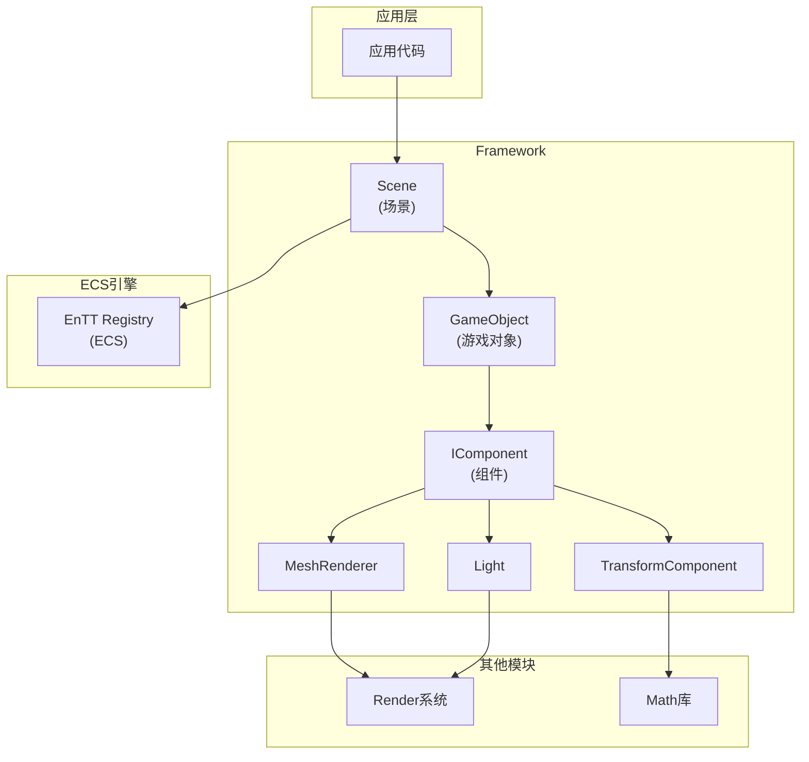
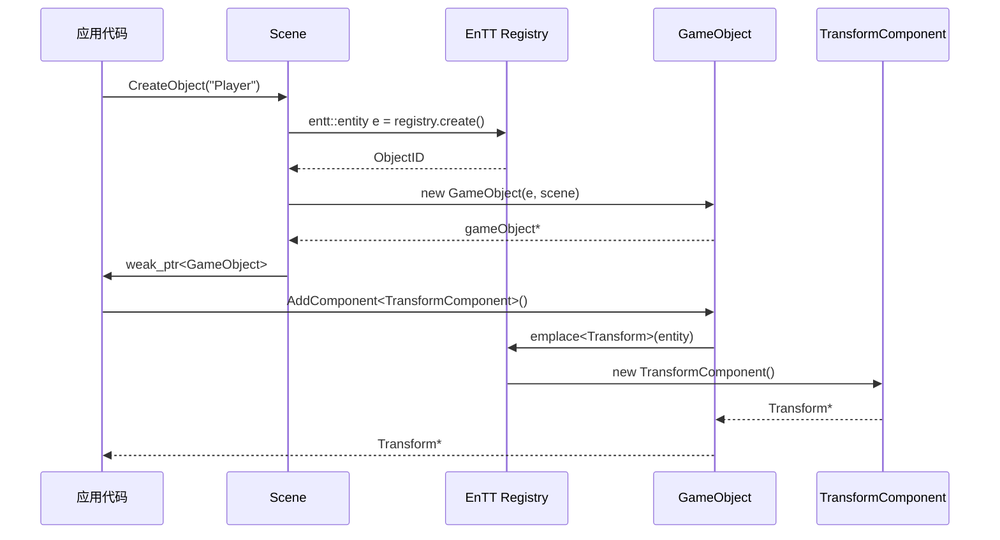

# DSMEngine Runtime/Framework 模块分析文档

## 文档概述

本文档详细分析 DSMEngine 的 **Runtime/Framework** 模块，这是游戏引擎的游戏逻辑和场景管理核心。该模块实现了 Entity-Component-System (ECS) 架构，使用 EnTT 库提供高效的数据驱动设计。模块负责场景管理、游戏对象生命周期、组件系统和脚本支持。

---

## 1. 代码结构与组织方式

### 1.1 目录结构

```
DSMEngine/Runtime/Framework/
├── Scene.h/cpp                          # 场景管理器
├── Object/
│   ├── GameObject.h/cpp                # 游戏对象
│   └── ObjectIDAllocator.h             # ID 分配器
├── Component/
│   ├── Component.h                     # 组件基类
│   ├── TransformComponent.h            # 变换组件
│   ├── CameraComponent.h               # 相机组件
│   ├── MeshRenderer.h                  # 网格渲染器
│   ├── Light.h                         # 光源组件
│   ├── NativeScript.h                  # 原生脚本
│   └── Renderer.h                      # 渲染器基类
└── ScriptableObject.h                  # 可脚本化对象基类
```

### 1.2 逻辑架构

```
┌─────────────────────────┐
│      Scene Manager      │  (场景管理)
├─────────────────────────┤
│  GameObject Container   │  (游戏对象容器)
├─────────────────────────┤
│    EnTT Registry        │  (ECS 注册表)
├─────────────────────────┤
│  Component System       │  (组件系统)
├─────────────────────────┤
│  Transform/Render/etc   │  (具体组件)
└─────────────────────────┘
```

### 1.3 ECS 数据组织

```
Entity ID (ObjectID)
    ↓
EnTT Registry
    ├── TransformComponent
    ├── MeshRenderer
    ├── Light
    ├── CameraComponent
    └── NativeScript
```

---

## 2. 核心功能与实现原理

### 2.1 模块职责

| 职责 | 描述 | 关键类 |
|------|------|--------|
| 场景管理 | 创建、销毁、更新场景 | `Scene` |
| 对象生命周期 | GameObject 的创建和销毁 | `GameObject`、`Scene` |
| 组件系统 | 动态添加/移除组件 | `IComponent`、`GameObject` |
| 变换管理 | 位置、旋转、缩放 | `TransformComponent` |
| 渲染管理 | 网格和模型渲染 | `MeshRenderer`、`Renderer` |
| 光源系统 | 不同类型的光源 | `Light` |
| 脚本支持 | C++ 脚本绑定 | `NativeScript` |

### 2.2 设计模式

#### 2.2.1 Entity-Component-System (ECS)

**传统 OOP 方式的问题：**
```cpp
// ❌ 深层继承树，难以维护
class GameObject { };
class Renderable : public GameObject { };
class Dynamic : public Renderable { };
class Player : public Dynamic { };  // 继承层数太多
```

**ECS 解决方案：**
```cpp
// ✅ 组合优于继承
class GameObject {
    std::unordered_set<Component*> components;
};

// 各种组件独立：
// - TransformComponent（位置、旋转、缩放）
// - MeshRenderer（渲染数据）
// - Light（光源数据）
// - NativeScript（脚本）
```

**优势：**
- 数据-导向设计，缓存友好
- 灵活组合，避免继承爆炸
- 支持动态添加/移除功能
- 系统级别的数据处理

#### 2.2.2 对象池与 ID 管理

使用 EnTT 的实体 ID 系统进行高效对象管理：

```cpp
// EnTT 实体 ID
using ObjectID = entt::entity;

// 优势：
// 1. 紧凑的数据布局
// 2. 高效的版本管理（检测对象删除）
// 3. 快速的组件查询
```

#### 2.2.3 层级树结构

Parent-Child 关系管理：

```cpp
class GameObject {
    std::weak_ptr<GameObject> m_Parent;
    std::unordered_set<std::shared_ptr<GameObject>> m_Children;
};
```

---

## 3. 关键类、函数及其作用

### 3.1 Scene 类（场景管理器）

**职责：** 管理所有游戏对象和 ECS 注册表

```cpp
class Scene {
public:
    // 构造/析构
    Scene() = default;
    ~Scene();
    
    // 拷贝和移动
    Scene(const Scene& other);
    Scene& operator=(const Scene& other);
    Scene(Scene&& other);
    Scene& operator=(Scene&& other);
    
    // 生命周期
    void Update(float deltaTime);      // 更新所有对象
    void OnGUI();                       // GUI 绘制
    
    // 脏标记
    bool IsDirty() const;
    void SetDirty(bool dirty);
    
    // 场景文件路径
    const std::string& GetSceneFilePath() const;
    void SetSceneFilePath(const std::string& path);
    
    // 对象操作
    ObjectID CreateObject(const std::string& name = {});
    void DestroyObject(ObjectID objectID);
    std::weak_ptr<GameObject> GetObjectByID(ObjectID objectID);
    
    // 组件查询（ECS 功能）
    template <typename... Component>
    auto GetObjectsWithComponents() { 
        return m_Registry.view<Component...>(); 
    }
    
    // 遍历所有对象
    template <typename Func>
    void TraverseAllEntity(Func func) const {
        m_Registry.view<entt::entity>().each(func);
    }
    
    // 获取所有对象
    auto& GetAllObjects() { return m_Objects; }
    const auto& GetRootObjects() const { return m_RootObjects; }
    
private:
    entt::registry m_Registry;  // ECS 注册表
    std::unordered_map<ObjectID, std::shared_ptr<GameObject>> m_Objects;
    std::unordered_set<std::shared_ptr<GameObject>> m_RootObjects;
    std::string m_SceneFilePath;
    bool m_IsDirty{false};
    
    static void CopyScene(Scene& dest, const Scene& src);
};
```

**关键特性：**

| 特性 | 说明 | 用途 |
|------|------|------|
| ECS 系统 | 高效数据布局 | 快速查询和迭代 |
| 对象映射 | ID -> GameObject | 快速查找 |
| 根对象集 | 无父对象集合 | 场景树顶部 |
| 脏标记 | 追踪修改 | 序列化判断 |

### 3.2 GameObject 类（游戏对象）

**职责：** 游戏对象容器和组件管理

```cpp
class GameObject : public std::enable_shared_from_this<GameObject> {
public:
    GameObject(ObjectID handle, Scene* scene);
    virtual ~GameObject() = default;
    
    virtual void Update(float deltaTime) {}
    
    // 标识信息
    ObjectID GetID() const noexcept { return m_Handle; }
    const std::string& GetName() const noexcept { return m_Name; }
    void SetName(const std::string& name) noexcept { m_Name = name; }
    const std::string& GetTag() const noexcept { return m_Tag; }
    void SetTag(const std::string& tag) noexcept { m_Tag = tag; }
    
    // 激活/禁用
    bool IsEnabled() const noexcept { return m_Enabled; }
    void SetEnabled(bool enabled) noexcept { m_Enabled = enabled; }
    
    // 组件操作
    template <typename T>
    bool HasComponent() const noexcept {
        return m_World->m_Registry.all_of<T>(m_Handle);
    }
    
    template <typename T>
    T* GetComponent() noexcept {
        return m_World->m_Registry.try_get<T>(m_Handle);
    }
    
    template <typename T, typename... Args>
    T* AddComponent(Args&&... args) noexcept {
        if (HasComponent<T>()) return nullptr;
        return &m_World->m_Registry.emplace<T>(
            m_Handle, shared_from_this(), std::forward<Args>(args)...);
    }
    
    template <typename T, typename... Args>
    T* AddOrReplaceComponent(Args&&... args) noexcept {
        return &m_World->m_Registry.emplace_or_replace<T>(
            m_Handle, shared_from_this(), std::forward<Args>(args)...);
    }
    
    template <typename T>
    bool RemoveComponent() noexcept {
        if (HasComponent<T>()) {
            m_World->m_Registry.remove<T>(m_Handle);
            return true;
        }
        return false;
    }
    
    // 层级关系
    void AddChild(const std::shared_ptr<GameObject>& child);
    void RemoveChild(const std::shared_ptr<GameObject>& child);
    void SetParent(const std::shared_ptr<GameObject>& parent);
    const auto& GetChildren() const noexcept { return m_Children; }
    std::shared_ptr<GameObject> GetParent() const noexcept {
        return m_Parent.lock();
    }
    
private:
    std::unordered_set<std::shared_ptr<GameObject>> m_Children;
    std::weak_ptr<GameObject> m_Parent;
    std::string m_Name{"GameObject"};
    std::string m_Tag{"Untagged"};
    Scene* m_World;
    ObjectID m_Handle;
    bool m_Enabled = true;
};
```

**时间复杂度：**

| 操作 | 复杂度 | 说明 |
|------|--------|------|
| AddComponent | O(1) | 常数时间添加 |
| GetComponent | O(1) | 直接 Registry 查询 |
| HasComponent | O(1) | 快速检查 |
| GetObjectsWithComponents | O(n) | n=符合条件的对象数 |

### 3.3 TransformComponent 类（变换组件）

**职责：** 管理游戏对象的位置、旋转、缩放

```cpp
class TransformComponent : public Math::Transform, public IComponent {
public:
    // 构造函数
    TransformComponent(std::shared_ptr<GameObject> gameObject);
    TransformComponent(std::shared_ptr<GameObject> go, 
                      Vector3 pos, Vector3 scale, Quaternion rot);
    TransformComponent(std::shared_ptr<GameObject> go, const Matrix4& matrix);
    
    // Getter
    const Vector3& GetPosition() const noexcept { return m_Position; }
    const Vector3& GetScale() const noexcept { return m_Scale; }
    const Quaternion& GetRotation() const noexcept { return m_Rotation; }
    
    // 坐标轴
    Vector3 GetRightAxis() const noexcept;   // X 轴
    Vector3 GetUpAxis() const noexcept;      // Y 轴
    Vector3 GetForwardAxis() const noexcept; // Z 轴
    
    // 矩阵
    Matrix4 GetLocalToWorld() const noexcept;
    Matrix4 GetWorldToLocal() const noexcept;
    
    // Setter
    void SetPosition(Vector3 pos) noexcept;
    void SetPosition(float x, float y, float z) noexcept;
    void SetScale(Vector3 scale) noexcept;
    void SetRotation(Quaternion rot) noexcept;
    void SetRotation(float pitch, float yaw, float roll) noexcept;
    
    // 变换操作
    void Translate(Vector3 translation) noexcept;
    void Rotate(const Vector3& axis, float angle) noexcept;
    void Rotate(const Vector3& pyr) noexcept;
    void Rotate(Vector3 point, Vector3 axis, float angle) noexcept;
    
    // 摄像机操作
    void LookAt(const Vector3& target, Vector3 up = {0, 1, 0}) noexcept;
    void LookTo(const Vector3& dir, Vector3 up = {0, 1, 0}) noexcept;
    
private:
    Vector3 m_Position{};
    Vector3 m_Scale{1, 1, 1};
    Quaternion m_Rotation;
};
```

**关键方法说明：**

| 方法 | 功能 | 示例 |
|------|------|------|
| GetLocalToWorld | 获取本地到世界变换 | `matrix = transform->GetLocalToWorld()` |
| Translate | 平移 | `transform->Translate({1, 2, 3})` |
| Rotate | 旋转 | `transform->Rotate({0,1,0}, 3.14f)` |
| LookAt | 看向目标 | `transform->LookAt(targetPos)` |

### 3.4 MeshRenderer 类（网格渲染器）

**职责：** 管理网格和模型数据

```cpp
class MeshRenderer : public Renderer {
public:
    MeshRenderer(std::shared_ptr<GameObject> gameObject) 
        : Renderer(gameObject) {}
    
    // 网格管理
    const std::shared_ptr<Mesh>& GetMesh() const noexcept { return m_Mesh; }
    void SetMesh(const std::shared_ptr<Mesh>& mesh) noexcept;
    
    // 模型管理
    std::shared_ptr<Model> GetModel() const noexcept { return m_Model; }
    void SetModel(const std::shared_ptr<Model>& model) noexcept;
    
    // 材质映射
    size_t GetMaterialIndex(size_t subMeshIndex) const noexcept;
    void SetMaterialIndex(size_t subMeshIndex, size_t materialIndex) noexcept;
    
private:
    std::shared_ptr<Mesh> m_Mesh;
    std::shared_ptr<Model> m_Model;
    std::vector<size_t> m_SubMeshMaterialIndices;
};
```

### 3.5 Light 类（光源组件）

**职责：** 定义光源的类型、颜色和参数

```cpp
enum class LightType {
    Directional,    // 平行光
    Point,          // 点光源
    Spot,           // 聚光灯
};

class Light : public IComponent {
public:
    Light(std::shared_ptr<GameObject> go) : IComponent(go) {}
    
    // 光源类型
    LightType GetType() const noexcept { return m_Type; }
    Light& SetType(LightType type) noexcept {
        m_Type = type; m_IsDirty = true; return *this;
    }
    
    // 颜色和强度
    const Vector4& GetColor() const noexcept { return m_Color; }
    Light& SetColor(const Vector4& color) noexcept {
        m_Color = color; m_IsDirty = true; return *this;
    }
    
    // 方向（平行光和聚光灯）
    const Vector3& GetDirection() const noexcept { return m_Direction; }
    Light& SetDirection(const Vector3& dir) noexcept {
        m_Direction = dir; m_IsDirty = true; return *this;
    }
    
    // 位置（点光源和聚光灯）
    const Vector3& GetPosition() const noexcept { return m_Position; }
    Light& SetPosition(const Vector3& pos) noexcept {
        m_Position = pos; m_IsDirty = true; return *this;
    }
    
    // 范围和角度
    float GetRange() const noexcept { return m_Range; }
    Light& SetRange(float range) noexcept {
        m_Range = range; m_IsDirty = true; return *this;
    }
    
    float GetInnerAngle() const noexcept { return m_InnerAngle; }
    float GetOuterAngle() const noexcept { return m_OuterAngle; }
    Light& SetInnerAngle(float angle) noexcept {
        m_InnerAngle = angle; m_IsDirty = true; return *this;
    }
    Light& SetOuterAngle(float angle) noexcept {
        m_OuterAngle = angle; m_IsDirty = true; return *this;
    }
    
private:
    LightType m_Type = LightType::Directional;
    Vector3 m_Direction{0, -1, 0};
    Vector3 m_Position{};
    Vector4 m_Color{1, 1, 1, 1};
    float m_Range = 100.0f;
    float m_InnerAngle = 0.0f;
    float m_OuterAngle = 0.785f;  // 45 度
};
```

---

## 4. 模块间的调用关系与接口定义

### 4.1 依赖关系图



### 4.2 对象创建流程



### 4.3 组件查询流程

```
应用查询："获取所有有Transform和Renderer的对象"
    ↓
Scene::GetObjectsWithComponents<Transform, Renderer>()
    ↓
EnTT Registry::view<Transform, Renderer>()
    ↓
返回迭代器（高效过滤）
    ↓
遍历符合条件的对象
```

---

## 5. 依赖关系与数据流

### 5.1 外部依赖

| 依赖 | 用途 | 版本 |
|------|------|------|
| **EnTT** | Entity Component System | 3.x |
| **Math 库** | 数学计算 | 内部 |
| **Render 系统** | 渲染数据 | 内部 |

### 5.2 数据流

#### 对象创建数据流

```
CreateObject()
    ↓
生成新 Entity ID
    ↓
创建 GameObject 容器
    ↓
添加到 Scene.m_Objects
    ↓
添加到 Scene.m_RootObjects
    ↓
返回给应用
```

#### 组件添加数据流

```
AddComponent<T>()
    ↓
检查是否已有该组件
    ↓
在 Registry 中 emplace 新组件
    ↓
调用组件构造函数
    ↓
返回组件指针
```

#### 场景更新数据流

```
Scene::Update(deltaTime)
    ↓
遍历所有 NativeScript 组件
    ↓
调用每个脚本的 OnUpdate()
    ↓
更新变换（父子关系）
    ↓
标记渲染数据需要更新
```

---

## 6. 重要算法与技术细节

### 6.1 ECS 查询算法

**问题：** 如何高效找到所有具有特定组件集合的实体？

**解决方案：** EnTT 的稀疏集合数据结构

```cpp
// 查询：找所有同时有 Transform 和 Renderer 的对象
auto view = registry.view<Transform, Renderer>();

// 内部实现：
// 1. 维护每个组件类型的实体列表
// 2. 返回这些列表的交集
// 3. 迭代器遍历时只访问有效的实体

for (auto entity : view) {
    auto& transform = view.get<Transform>(entity);
    auto& renderer = view.get<Renderer>(entity);
}
```

**时间复杂度：** O(n) n=最小列表的大小

### 6.2 层级树更新算法

```cpp
// 当 Parent 移动时，自动更新所有 Child
void TransformComponent::Update() {
    if (auto parent = GetParent()) {
        auto* parentTransform = parent->GetComponent<TransformComponent>();
        auto worldMatrix = parentTransform->GetLocalToWorld() * 
                          GetLocalToWorld();
        // 使用 worldMatrix 用于渲染
    }
}
```

**时间复杂度：** O(树深度)

### 6.3 组件添加/移除的版本管理

EnTT 使用版本号检测实体的有效性：

```cpp
// Entity 结构
struct entity {
    uint32_t entity_id;     // 实体索引
    uint32_t version;       // 版本号
};

// 删除时增加版本号
DestroyObject(id) {
    version[id]++;  // 旧 ID 失效
}

// 检查 ID 有效性
bool IsValid(entity e) {
    return version[e.entity_id] == e.version;
}
```

---

## 7. 使用示例与最佳实践

### 7.1 创建简单场景

```cpp
// 创建场景
Scene scene;

// 创建玩家对象
auto playerId = scene.CreateObject("Player");
auto player = scene.GetObjectByID(playerId).lock();

// 添加变换组件
auto* transform = player->AddComponent<TransformComponent>();
transform->SetPosition(0, 1, 0);
transform->SetScale(1, 2, 1);  // 高度为 2

// 添加网格渲染器
auto* renderer = player->AddComponent<MeshRenderer>();
renderer->SetMesh(playerMesh);
renderer->SetModel(playerModel);

// 创建摄像机
auto cameraId = scene.CreateObject("MainCamera");
auto camera = scene.GetObjectByID(cameraId).lock();
auto* cameraTransform = camera->AddComponent<TransformComponent>();
cameraTransform->SetPosition(0, 2, 5);
cameraTransform->LookAt(player->GetComponent<TransformComponent>()->GetPosition());

auto* cameraComp = camera->AddComponent<CameraComponent>();
cameraComp->SetFOV(60.0f);
```

### 7.2 父子关系设置

```cpp
// 创建容器对象
auto containerId = scene.CreateObject("Container");
auto container = scene.GetObjectByID(containerId).lock();

// 创建子对象
auto child1Id = scene.CreateObject("Child1");
auto child1 = scene.GetObjectByID(child1Id).lock();

auto child2Id = scene.CreateObject("Child2");
auto child2 = scene.GetObjectByID(child2Id).lock();

// 建立父子关系
container->AddChild(child1);
container->AddChild(child2);

// 等价于：
child1->SetParent(container);
child2->SetParent(container);

// 设置位置（相对于父对象）
child1->GetComponent<TransformComponent>()->SetPosition(1, 0, 0);
child2->GetComponent<TransformComponent>()->SetPosition(-1, 0, 0);

// 当父对象移动时，子对象也会跟随
container->GetComponent<TransformComponent>()->SetPosition(5, 0, 0);
```

### 7.3 组件查询

```cpp
// 查询所有有 MeshRenderer 的对象（可见对象）
auto renderables = scene.GetObjectsWithComponents<TransformComponent, MeshRenderer>();

for (auto entity : renderables) {
    auto* transform = scene.GetObjectByID(entity).lock()->GetComponent<TransformComponent>();
    auto* renderer = scene.GetObjectByID(entity).lock()->GetComponent<MeshRenderer>();
    
    // 使用 transform 和 renderer 数据进行渲染
}

// 查询所有光源
auto lights = scene.GetObjectsWithComponents<Light>();

for (auto entity : lights) {
    auto* light = scene.GetObjectByID(entity).lock()->GetComponent<Light>();
    // 使用光源数据
}
```

### 7.4 遍历所有对象

```cpp
// 方法 1：使用 TraverseAllEntity
scene.TraverseAllEntity([&scene](auto entity) {
    auto obj = scene.GetObjectByID(entity).lock();
    if (obj && obj->IsEnabled()) {
        // 处理对象
    }
});

// 方法 2：直接访问对象映射
for (const auto& [id, obj] : scene.GetAllObjects()) {
    if (obj->IsEnabled()) {
        // 处理对象
    }
}

// 方法 3：只遍历根对象
for (const auto& rootObj : scene.GetRootObjects()) {
    // 递归处理整个树
    ProcessGameObject(rootObj);
}
```

### 7.5 脚本使用示例

```cpp
// 创建脚本
auto scriptId = scene.CreateObject("PlayerController");
auto scriptObj = scene.GetObjectByID(scriptId).lock();

auto* script = scriptObj->AddComponent<NativeScript>();
script->Bind<PlayerController>();

// PlayerController 类定义
class PlayerController : public IComponent {
public:
    PlayerController(std::shared_ptr<GameObject> go) : IComponent(go) {}
    
    void OnUpdate(float deltaTime) override {
        // 处理输入
        // 更新逻辑
    }
};
```

### 7.6 场景序列化

```cpp
// 保存场景
scene.SetSceneFilePath("Assets/Scenes/Level1.scene");
scene.SetDirty(false);  // 标记为已保存

// 加载场景
Scene loadedScene;
loadedScene.SetSceneFilePath("Assets/Scenes/Level1.scene");
// 加载逻辑... (需要实现)
```

### 7.7 最佳实践

#### ✅ 推荐做法

| 做法 | 原因 | 示例 |
|------|------|------|
| 使用 ECS 查询 | 高效批量处理 | `GetObjectsWithComponents<T>()` |
| 组件组合 | 灵活、易维护 | 多个小组件而非一个大类 |
| 启用/禁用对象 | 避免销毁重建 | `SetEnabled(false)` |
| 管理对象生命周期 | 由 Scene 负责 | 不要手动 delete |
| 缓存组件指针 | 避免重复查询 | `auto* tf = obj->GetComponent<Transform>()` |

#### ❌ 避免的做法

| 做法 | 问题 | 替代方案 |
|------|------|---------|
| 深层继承树 | 难以维护、灵活性差 | 使用 ECS 组件 |
| 直接访问注册表 | 破坏抽象 | 通过 Scene 和 GameObject |
| 长时间持有对象指针 | 对象可能被删除 | 使用 weak_ptr |
| 在析构中访问场景 | 不安全 | 显式清理 |

---

## 8. 常见问题与解决方案

### Q1: 如何判断游戏对象是否已被删除？

**A:**

```cpp
// 使用 weak_ptr 检查
auto obj = scene.GetObjectByID(id).lock();
if (obj == nullptr) {
    // 对象已被删除
}

// 或者检查 ID 有效性
if (scene.GetObjectByID(id).expired()) {
    // 对象已被删除
}
```

### Q2: 删除父对象时，子对象会发生什么？

**A:**

```cpp
// 当前实现：子对象仍存在（断开父子关系）
// 推荐：自动删除子对象
parent->DestroyObject(parentId);  // 子对象的 parent weak_ptr 失效

// 为了自动删除子对象，需要实现：
void DestroyObjectRecursive(ObjectID id) {
    auto obj = GetObjectByID(id).lock();
    if (obj) {
        for (auto& child : obj->GetChildren()) {
            DestroyObjectRecursive(child->GetID());
        }
    }
    DestroyObject(id);
}
```

### Q3: 性能：ECS 查询 vs 维护对象列表

**A:**

ECS 查询通常更快：

```cpp
// ❌ 维护手动列表（高维护成本）
std::vector<GameObject*> renderables;  // 手动更新

// ✅ ECS 查询（自动、高效）
auto view = scene.GetObjectsWithComponents<Renderer>();
for (auto entity : view) {
    // 只访问有 Renderer 的对象
}

// 性能对比：
// - 查询 1M 对象中 1000 个可渲染对象：~1ms（ECS）
// - 维护列表需要手动同步：容易出错
```

### Q4: 如何实现对象池优化？

**A:**

```cpp
class ObjectPool {
    std::vector<std::shared_ptr<GameObject>> m_Available;
    std::vector<std::shared_ptr<GameObject>> m_InUse;
    
public:
    std::shared_ptr<GameObject> GetOrCreate(Scene& scene) {
        if (!m_Available.empty()) {
            auto obj = m_Available.back();
            m_Available.pop_back();
            obj->SetEnabled(true);
            m_InUse.push_back(obj);
            return obj;
        } else {
            auto obj = scene.GetObjectByID(
                scene.CreateObject()).lock();
            m_InUse.push_back(obj);
            return obj;
        }
    }
    
    void Release(std::shared_ptr<GameObject> obj) {
        obj->SetEnabled(false);
        auto it = std::find(m_InUse.begin(), m_InUse.end(), obj);
        if (it != m_InUse.end()) {
            m_InUse.erase(it);
            m_Available.push_back(obj);
        }
    }
};
```

---

## 9. 术语表

| 术语 | 定义 | 相关 |
|------|------|------|
| **Entity** | 实体，游戏世界中的对象 | GameObject |
| **Component** | 组件，实体的属性/功能 | TransformComponent |
| **System** | 系统，操作组件的逻辑 | Scene Update |
| **ECS** | Entity-Component-System 架构 | EnTT |
| **Registry** | 组件注册表，存储所有组件数据 | entt::registry |
| **Entity ID** | 实体标识符 | ObjectID |
| **Version** | 版本号，用于检测过期 ID | EnTT 内部 |
| **Query** | 查询，获取符合条件的实体 | GetObjectsWithComponents |
| **Hierarchy** | 层级树，父子关系 | Parent/Children |
| **Dirty Flag** | 脏标记，追踪修改状态 | m_IsDirty |

---

## 总结

Framework 模块实现了强大的 ECS 架构：

✅ **优势：**
- 灵活的组件组合
- 高效的数据布局（缓存友好）
- 强大的查询系统
- 清晰的职责分离

⚠️ **改进方向：**
- 完善对象池系统
- 添加序列化/反序列化
- 优化层级树更新
- 添加系统调度器

---

**文档版本：** v1.0  
**最后更新：** 2026-04-16

---
