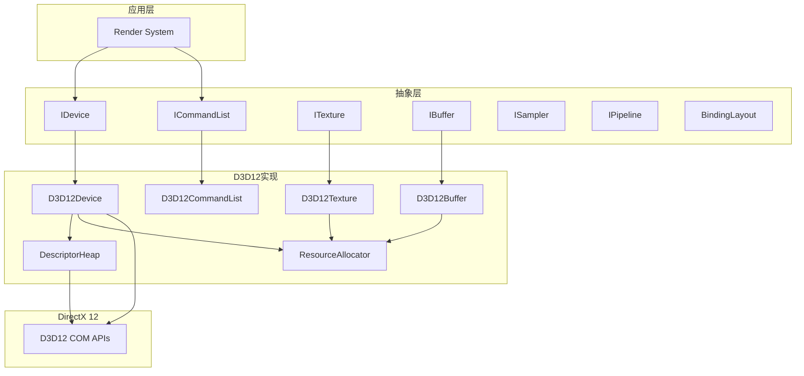
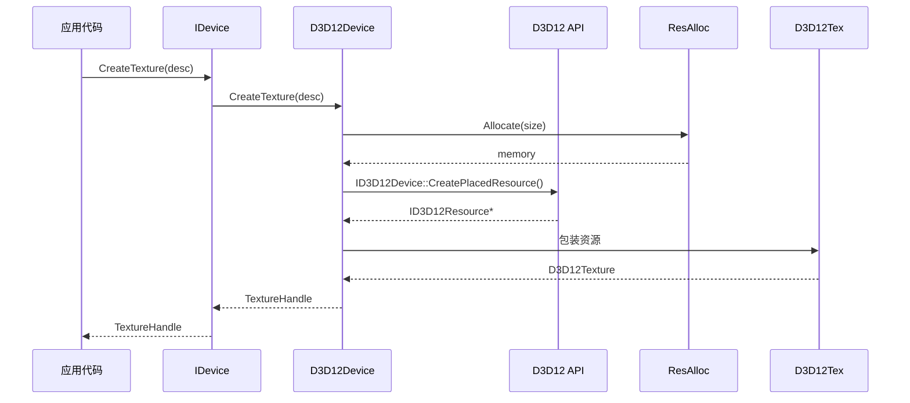

# DSMEngine Runtime/Graphics 模块分析文档

## 文档概述

本文档详细分析 DSMEngine 的 **Runtime/Graphics** 模块，这是整个引擎的图形系统核心。该模块提供了对图形 API 的高层抽象，并实现了完整的 DirectX 12 后端，支持现代 GPU 特性如资源绑定、管道状态、描述符管理等。

---

## 1. 代码结构与组织方式

### 1.1 目录结构

```
DSMEngine/Runtime/Graphics/
├── Device.h                           # 图形设备抽象接口
├── CommandList.h                      # 命令列表抽象接口
├── Resource.h                         # GPU 资源基类
├── Texture.h/Texture.cpp             # 纹理资源
├── Buffer.h/Buffer.cpp               # 缓冲区资源
├── Shader.h/Shader.cpp               # 着色器
├── Sampler.h                         # 采样器
├── PipelineState.h                   # 管道状态
├── ResourceBindings.h/cpp            # 资源绑定系统
├── BindingLayout.h                   # 绑定布局定义
├── Framebuffer.h                     # 帧缓冲
├── Heap.h                            # 内存堆管理
├── QueryObject.h                     # 查询对象（计时、事件）
├── D3D12/                            # DirectX 12 实现
│   ├── D3D12Common.h                # D3D12 公共定义
│   ├── D3D12-Device.h/cpp           # D3D12 设备实现
│   ├── D3D12-CommandList.h/cpp      # D3D12 命令列表
│   ├── D3D12-Texture.h/cpp          # D3D12 纹理
│   ├── D3D12-Buffer.h/cpp           # D3D12 缓冲
│   ├── D3D12-Shader.h/cpp           # D3D12 着色器
│   ├── D3D12-ResourceBindings.h/cpp # D3D12 资源绑定
│   ├── D3D12-PipelineState.h/cpp    # D3D12 管道状态
│   ├── DescriptorHeap.h/cpp         # 描述符堆管理
│   ├── PlacedResourceAllocator.h/cpp # 保留资源分配
│   ├── DynamicResourceAllocator.h    # 动态资源分配
│   ├── D3D12-FrameBuffer.h/cpp      # D3D12 帧缓冲
│   └── RootSignature.h              # D3D12 根签名
└── StateTracking.cpp                 # 状态追踪
```

### 1.2 逻辑层次结构

```
┌─────────────────────────────────┐
│     应用层（Render System）      │
├─────────────────────────────────┤
│  图形抽象层（IDevice, ITexture） │
├─────────────────────────────────┤
│   D3D12 实现层（Device, Texture） │
├─────────────────────────────────┤
│    DirectX 12 COM 接口           │
├─────────────────────────────────┤
│      GPU 硬件                     │
└─────────────────────────────────┘
```

---

## 2. 核心功能与实现原理

### 2.1 模块职责

| 职责 | 描述 | 关键类 |
|------|------|--------|
| GPU 设备管理 | 创建、管理 GPU 设备 | `IDevice`、`D3D12Device` |
| 资源管理 | 创建和管理纹理、缓冲等 | `ITexture`、`IBuffer` |
| 命令记录 | 记录 GPU 命令 | `ICommandList` |
| 资源绑定 | 将资源绑定到着色器 | `BindingLayout`、`BindingSet` |
| 内存管理 | GPU 内存分配和回收 | `DescriptorHeap`、`Allocator` |
| 管道状态 | 管理图形/计算管道 | `GraphicsPipeline`、`ComputePipeline` |

### 2.2 设计模式

#### 2.2.1 抽象工厂模式

创建与具体 API 无关的对象：

```cpp
// 抽象接口
class IDevice {
    virtual TextureHandle CreateTexture(const TextureDesc& desc) = 0;
    virtual BufferHandle CreateBuffer(const BufferDesc& desc) = 0;
    virtual CommandListHandle CreateCommandList(...) = 0;
};

// 具体实现
class D3D12Device : public IDevice {
    TextureHandle CreateTexture(const TextureDesc& desc) override;
    BufferHandle CreateBuffer(const BufferDesc& desc) override;
    CommandListHandle CreateCommandList(...) override;
};

// 使用方式
DeviceHandle device = std::make_shared<D3D12Device>(desc);
TextureHandle texture = device->CreateTexture(textureDesc);
```

#### 2.2.2 引用计数模式

使用智能指针管理资源生命周期：

```cpp
// Handle 定义
template<typename T>
using RefPtr = std::shared_ptr<T>;

using DeviceHandle = RefPtr<IDevice>;
using TextureHandle = RefPtr<ITexture>;
using BufferHandle = RefPtr<IBuffer>;

// 自动内存管理
{
    TextureHandle texture = device->CreateTexture(desc);
}  // 自动释放，调用析构函数
```

#### 2.2.3 命令缓冲模式

延迟执行 GPU 命令：

```cpp
// 记录阶段
{
    CommandListHandle cmdList = device->CreateCommandList();
    cmdList->ClearRenderTarget(rtv, color);
    cmdList->DrawMesh(mesh);
}

// 提交阶段
device->ExecuteCommandLists({cmdList});

// 执行阶段（GPU）
// GPU 执行所有命令
```

---

## 3. 关键类、函数及其作用

### 3.1 IDevice 接口（图形设备）

**职责：** 图形 API 的高层抽象，管理所有 GPU 资源

```cpp
struct IDevice : public IResource {
    // 堆管理
    virtual HeapHandle CreateHeap(const HeapDesc& d) = 0;
    
    // 纹理创建
    virtual TextureHandle CreateTexture(const TextureDesc& d) = 0;
    virtual MemoryRequirements GetTextureMemoryRequirements(ITexture* tex) = 0;
    virtual bool BindTextureMemory(ITexture* tex, IHeap* heap, uint64_t offset) = 0;
    
    // 缓冲创建
    virtual BufferHandle CreateBuffer(const BufferDesc& d) = 0;
    virtual void* MapBuffer(IBuffer* buffer, CpuAccessMode mode) = 0;
    virtual void UnmapBuffer(IBuffer* buffer) = 0;
    
    // 着色器
    virtual ShaderHandle CreateShader(const ShaderDesc& d, 
                                     const void* binary, size_t size) = 0;
    
    // 采样器
    virtual SamplerHandle CreateSampler(const SamplerDesc& d) = 0;
    
    // 输入布局
    virtual InputLayoutHandle CreateInputLayout(
        std::span<const VertexAttributeDesc> descs, 
        IShader* vertexShader) = 0;
    
    // 查询对象
    virtual EventQueryHandle CreateEventQuery() = 0;
    virtual TimerQueryHandle CreateTimerQuery() = 0;
    virtual bool PollEventQuery(IEventQuery* query) = 0;
    
    // 帧缓冲和管道
    virtual FramebufferHandle CreateFramebuffer(const FramebufferDesc& desc) = 0;
    virtual GraphicsPipelineHandle CreateGraphicsPipeline(
        const GraphicsPipelineDesc& desc, IFramebuffer* fb) = 0;
    virtual ComputePipelineHandle CreateComputePipeline(
        const ComputePipelineDesc& desc) = 0;
    
    // 资源绑定
    virtual BindingLayoutHandle CreateBindingLayout(
        const BindingLayoutDesc& desc) = 0;
    virtual BindingSetHandle CreateBindingSet(
        const BindingSetDesc& desc, IBindingLayout* layout) = 0;
    
    // 命令列表
    virtual CommandListHandle CreateCommandList(
        const CommandListParameters& params) = 0;
    virtual uint64_t ExecuteCommandLists(
        std::span<ICommandList* const> cmdLists,
        CommandQueueType queue = CommandQueueType::Graphics) = 0;
    
    // 同步
    virtual bool WaitForIdle() = 0;
    virtual void RunGarbageCollection() = 0;
    
    // 能力查询
    virtual bool QueryFeatureSupport(Feature feature, void* info) = 0;
    virtual FormatSupport QueryFormatSupport(Format format) = 0;
};

// Handle 定义
using DeviceHandle = RefPtr<IDevice>;
```

**关键方法详解：**

| 方法 | 功能 | 参数 | 返回值 |
|------|------|------|--------|
| `CreateTexture` | 创建纹理 | TextureDesc | TextureHandle |
| `CreateBuffer` | 创建缓冲 | BufferDesc | BufferHandle |
| `MapBuffer` | CPU 访问缓冲 | IBuffer*, CpuAccessMode | void* |
| `UnmapBuffer` | 取消映射 | IBuffer* | void |
| `CreateCommandList` | 创建命令列表 | CommandListParameters | CommandListHandle |
| `ExecuteCommandLists` | 提交命令 | span<ICommandList*> | uint64_t(栅栏值) |
| `WaitForIdle` | 等待 GPU 完成 | 无 | bool |

### 3.2 ICommandList 接口（命令列表）

**职责：** 记录 GPU 命令

```cpp
struct ICommandList : public IResource {
    // 渲染目标管理
    virtual void SetRenderTargets(
        std::span<const ColorAttachment> colorAttachments,
        const DepthAttachment* depthAttachment) = 0;
    
    // 清屏
    virtual void ClearColorAttachment(uint32_t index, const float color[4]) = 0;
    virtual void ClearDepthAttachment(float depth) = 0;
    
    // 视口和裁剪
    virtual void SetViewport(const Viewport& viewport) = 0;
    virtual void SetScissorRect(const Rect& rect) = 0;
    
    // 管道绑定
    virtual void BindGraphicsPipeline(IGraphicsPipeline* pipeline) = 0;
    virtual void BindComputePipeline(IComputePipeline* pipeline) = 0;
    
    // 资源绑定
    virtual void BindBindingSet(uint32_t index, IBindingSet* set) = 0;
    virtual void BindDescriptorTable(uint32_t index, 
                                    IDescriptorTable* table) = 0;
    
    // 顶点/索引缓冲
    virtual void BindVertexBuffer(uint32_t slot, IBuffer* buffer, 
                                 uint32_t offset, uint32_t stride) = 0;
    virtual void BindIndexBuffer(IBuffer* buffer, Format format, 
                                uint32_t offset) = 0;
    
    // 绘制调用
    virtual void DrawIndexed(uint32_t indexCount, uint32_t indexOffset, 
                            int32_t vertexOffset) = 0;
    virtual void Draw(uint32_t vertexCount, uint32_t vertexOffset) = 0;
    virtual void DrawInstanced(uint32_t vertexCountPerInstance, 
                              uint32_t instanceCount) = 0;
    
    // 调度计算
    virtual void Dispatch(uint32_t x, uint32_t y, uint32_t z) = 0;
    
    // 资源转移
    virtual void CopyBuffer(IBuffer* src, IBuffer* dst, 
                           uint32_t size, uint32_t srcOffset = 0, 
                           uint32_t dstOffset = 0) = 0;
    virtual void CopyTexture(ITexture* src, ITexture* dst) = 0;
    
    // 查询
    virtual void BeginQuery(IEventQuery* query) = 0;
    virtual void EndQuery(IEventQuery* query) = 0;
    
    // 获取描述符
    virtual const CommandListDesc& GetDesc() const = 0;
};

using CommandListHandle = RefPtr<ICommandList>;
```

### 3.3 ITexture 接口（纹理资源）

**职责：** 管理 GPU 纹理数据

```cpp
struct TextureDesc {
    uint32_t width;              // 宽度（像素）
    uint32_t height;             // 高度（像素）
    uint32_t depth;              // 深度（体积纹理）
    uint16_t arraySize;          // 数组大小
    uint16_t mipLevels;          // Mip 级别数
    TextureDimension dimension;  // 1D/2D/3D/Cube
    Format format;               // 数据格式
    SampleCount sampleCount;     // MSAA 采样数
    Usage usage;                 // 用途（RenderTarget、DepthStencil 等）
    CpuAccessMode cpuAccess;     // CPU 访问类型
};

struct ITexture : public IResource {
    virtual const TextureDesc& GetDesc() const = 0;
    virtual Format GetFormat() const = 0;
    virtual void* Map(uint32_t mipLevel = 0, uint32_t arrayIndex = 0) = 0;
    virtual void Unmap() = 0;
};

using TextureHandle = RefPtr<ITexture>;

// 常见用途
enum class Usage {
    Default = 0,           // GPU 优化，无 CPU 访问
    Immutable,             // 不可变，初始化后无法修改
    Dynamic,               // 可被 CPU 频繁更新
    Staging,               // 用于 CPU-GPU 传输
    RenderTarget,          // 可用作渲染目标
    DepthStencil,          // 深度/模板缓冲
    UnorderedAccess,       // UAV（计算着色器）
};

// 格式示例
enum class Format {
    Unknown = 0,
    R32G32B32A32_Float,   // 128-bit RGBA float
    R32G32B32A32_UInt,    // 128-bit RGBA unsigned int
    R32G32B32_Float,      // 96-bit RGB float
    R32G32_Float,         // 64-bit RG float
    R32_Float,            // 32-bit R float
    R8G8B8A8_UNorm,       // 32-bit RGBA unsigned normalized
    D32_Float,            // 32-bit depth
    D24_UNorm_S8_UInt,    // 24-bit depth + 8-bit stencil
    // ... 更多格式 ...
};
```

### 3.4 IBuffer 接口（缓冲资源）

```cpp
struct BufferDesc {
    uint32_t size;              // 大小（字节）
    Usage usage;                // 用途
    CpuAccessMode cpuAccess;    // CPU 访问
    uint32_t stride;            // 结构化缓冲步长（可选）
    uint32_t elementCount;      // 元素数量
};

struct IBuffer : public IResource {
    virtual const BufferDesc& GetDesc() const = 0;
    virtual uint32_t GetSize() const = 0;
};

// 常见用途
// - VertexBuffer：顶点数据
// - IndexBuffer：索引数据
// - ConstantBuffer：常数缓冲
// - StructuredBuffer：结构化缓冲
// - RWStructuredBuffer：读写缓冲
```

### 3.5 D3D12Device 实现

**职责：** DirectX 12 设备实现

```cpp
class D3D12Device final : public IDevice {
public:
    explicit D3D12Device(DeviceDesc desc);
    virtual ~D3D12Device() override;
    
    // 继承自 IDevice 的所有虚函数
    TextureHandle CreateTexture(const TextureDesc& desc) override;
    BufferHandle CreateBuffer(const BufferDesc& d) override;
    CommandListHandle CreateCommandList(...) override;
    
    // D3D12 特定方法
    RootSignatureHandle BuildRootSignature(
        const BindingLayoutVector& layouts,
        bool allowInputLayout, bool isLocal);
    
    GraphicsPipelineHandle CreateHandleForNativeGraphicsPipeline(
        IRootSignature* rootSig,
        ID3D12PipelineState* pipelineState,
        const GraphicsPipelineDesc& desc);
    
    // 访问 D3D12 对象
    CommandQueue* GetQueue(CommandQueueType type);
    Context& GetContext() noexcept;
    
    // 内部成员
private:
    Context m_Context;  // D3D12 COM 对象
    std::shared_ptr<DeviceResources> m_Resources;
    std::array<std::unique_ptr<CommandQueue>, (size_t)CommandQueueType::Count> 
        m_CommandQueues;
    
    // 特性支持标志
    bool m_RayTracingSupported;
    bool m_MeshletsSupported;
    bool m_VariableRateShadingSupported;
    // ... 更多特性 ...
};
```

### 3.6 DescriptorHeap 类（描述符管理）

**职责：** 管理 GPU 描述符堆

```cpp
class DescriptorHeap : public IDescriptorHeap {
public:
    // 分配描述符
    uint32_t AllocateDescriptor();
    uint32_t AllocateDescriptors(uint32_t count);
    
    // 释放描述符
    void ReleaseDescriptor(uint32_t index);
    void ReleaseDescriptors(uint32_t baseIndex, uint32_t count);
    
    // 获取句柄
    D3D12_CPU_DESCRIPTOR_HANDLE GetCpuHandle(uint32_t index);
    D3D12_CPU_DESCRIPTOR_HANDLE GetCpuHandleShaderVisible(uint32_t index);
    D3D12_GPU_DESCRIPTOR_HANDLE GetGpuHandle(uint32_t index);
    
    // 获取堆
    ID3D12DescriptorHeap* GetHeap() const;
    ID3D12DescriptorHeap* GetShaderVisibleHeap() const;
    
private:
    RefPtr<ID3D12DescriptorHeap> m_Heap;  // CPU 不可见
    RefPtr<ID3D12DescriptorHeap> m_ShaderVisibleHeap;  // CPU 可见
    LinearAllocator m_Allocator;
    std::mutex m_Mutex;
};
```

---

## 4. 模块间的调用关系与接口定义

### 4.1 依赖关系图



### 4.2 资源创建流程



### 4.3 命令记录流程

```
应用代码
  ↓
CommandList::SetRenderTargets() - 设置目标
  ↓
CommandList::BindPipeline() - 绑定管道
  ↓
CommandList::BindBindingSet() - 绑定资源
  ↓
CommandList::BindVertexBuffer() - 绑定顶点数据
  ↓
CommandList::DrawIndexed() - 发起绘制调用
  ↓
Device::ExecuteCommandLists() - 提交命令
  ↓
GPU 执行
```

---

## 5. 依赖关系与数据流

### 5.1 外部依赖

| 依赖 | 用途 | 位置 |
|------|------|------|
| **DirectX 12** | GPU 编程接口 | Windows SDK |
| **DXGI** | 交换链管理 | Windows SDK |
| **DXC** | 着色器编译 | DirectXShaderCompiler |
| **SLANG** | 着色器语言（可选） | ThirdParty |

### 5.2 GPU 内存数据流

```
应用层（CPU）
    ↓
常数缓冲/顶点缓冲/纹理（RAM）
    ↓
传输命令（DMA）
    ↓
GPU VRAM
    ↓
GPU 着色器（处理）
    ↓
渲染目标/存储缓冲（GPU VRAM）
    ↓
回读命令（可选）
    ↓
应用层（CPU）
```

### 5.3 纹理格式和转换

| 内部格式 | D3D12 格式 | 用途 |
|---------|-----------|------|
| `R32G32B32A32_Float` | `DXGI_FORMAT_R32G32B32A32_FLOAT` | HDR、浮点计算 |
| `R8G8B8A8_UNorm` | `DXGI_FORMAT_R8G8B8A8_UNORM` | 标准 8-bit RGBA |
| `D32_Float` | `DXGI_FORMAT_D32_FLOAT` | 深度缓冲 |
| `BC1_UNorm` | `DXGI_FORMAT_BC1_UNORM` | DXT1 压缩纹理 |

---

## 6. 重要算法与技术细节

### 6.1 描述符堆管理算法

**问题：** 描述符有限，需要高效分配和回收

**解决方案：** 线性分配器 + 碎片化管理

```cpp
class DescriptorHeap {
    LinearAllocator m_Allocator;  // 线性分配
    
    uint32_t AllocateDescriptor() {
        uint32_t index = m_Allocator.Allocate(1);
        return index;
    }
    
    void ReleaseDescriptor(uint32_t index) {
        m_Allocator.Free(index);
    }
};

// 时间复杂度：O(1) 分配，O(1) 释放
// 空间复杂度：O(n) n=描述符总数
```

**优化策略：**
- 池化分配：按类型分离描述符（SRV、RTV 等）
- 延迟释放：在 GPU 完成后再释放
- 紧凑化：周期性整理碎片

### 6.2 命令列表的命令缓冲

**原理：** 延迟执行，批量提交

```cpp
class D3D12CommandList {
    RefPtr<ID3D12GraphicsCommandList> m_CommandList;
    RefPtr<ID3D12CommandAllocator> m_Allocator;
    
    void Close() {
        m_CommandList->Close();  // 关闭录制
    }
    
    // GPU 命令被记录到 ID3D12GraphicsCommandList 内部缓冲中
};

// 提交流程
uint64_t ExecuteCommandLists(span<ICommandList*> lists) {
    // 关闭所有命令列表
    for (auto* list : lists) {
        list->Close();
    }
    
    // 转换为 D3D12 指针
    vector<ID3D12CommandList*> d3d12Lists;
    for (auto* list : lists) {
        d3d12Lists.push_back(list->GetNativeList());
    }
    
    // 提交到命令队列
    queue->ExecuteCommandLists(d3d12Lists.size(), d3d12Lists.data());
    
    // 返回栅栏值
    return queue->IncrementFence();
}
```

**时间复杂度：** O(n) n=命令列表数量

### 6.3 GPU-CPU 同步机制

**使用栅栏实现异步同步：**

```cpp
class CommandQueue {
    RefPtr<ID3D12Fence> m_Fence;
    uint64_t m_NextFenceValue = 1;
    
    // GPU 端：递增栅栏
    uint64_t IncrementFence() {
        queue->Signal(m_Fence.Get(), m_NextFenceValue);
        return m_NextFenceValue++;
    }
    
    // CPU 端：等待栅栏
    void WaitForFence(uint64_t fenceValue) {
        if (m_Fence->GetCompletedValue() < fenceValue) {
            HANDLE event = CreateEvent(nullptr, FALSE, FALSE, nullptr);
            m_Fence->SetEventOnCompletion(fenceValue, event);
            WaitForSingleObject(event, INFINITE);
            CloseHandle(event);
        }
    }
};

// 时间复杂度：O(1)，无阻塞轮询
```

### 6.4 根签名生成

**问题：** 不同绑定布局需要不同的根签名

**解决方案：** 缓存根签名

```cpp
class D3D12Device {
    std::unordered_map<size_t, RootSignature*> m_RootSigCache;
    
    RootSignatureHandle GetRootSignature(const BindingLayoutVector& layouts) {
        // 计算哈希
        size_t hash = ComputeHash(layouts);
        
        // 查找缓存
        auto it = m_RootSigCache.find(hash);
        if (it != m_RootSigCache.end()) {
            return it->second;  // 缓存命中
        }
        
        // 生成新根签名
        auto rootSig = CreateRootSignatureFromLayouts(layouts);
        m_RootSigCache[hash] = rootSig.Get();
        return rootSig;
    }
};

// 优化效果：避免重复创建，提高性能
```

---

## 7. 使用示例与最佳实践

### 7.1 基础设备初始化

```cpp
#include "Runtime/Graphics/Device.h"

// 创建设备
DeviceDesc deviceDesc{};
deviceDesc.adapterIndex = 0;
deviceDesc.enableDebug = true;
DeviceHandle device = std::make_shared<D3D12Device>(deviceDesc);

// 验证支持的特性
if (device->QueryFeatureSupport(Feature::RayTracing)) {
    std::cout << "Ray tracing supported" << std::endl;
}

// 检查格式支持
FormatSupport formatSupport = device->QueryFormatSupport(Format::R32G32B32A32_Float);
if (formatSupport & FormatSupport::RenderTarget) {
    std::cout << "Format supports render target" << std::endl;
}
```

### 7.2 纹理创建和使用

```cpp
// 创建渲染目标纹理
TextureDesc rtDesc{};
rtDesc.width = 1280;
rtDesc.height = 720;
rtDesc.format = Format::R8G8B8A8_UNorm;
rtDesc.usage = Usage::RenderTarget;
rtDesc.dimension = TextureDimension::Texture2D;

TextureHandle renderTarget = device->CreateTexture(rtDesc);

// 创建深度纹理
TextureDesc depthDesc{};
depthDesc.width = 1280;
depthDesc.height = 720;
depthDesc.format = Format::D32_Float;
depthDesc.usage = Usage::DepthStencil;

TextureHandle depthBuffer = device->CreateTexture(depthDesc);

// CPU 访问纹理（仅限 Dynamic/Staging）
TextureDesc stagingDesc{};
stagingDesc.width = 1280;
stagingDesc.height = 720;
stagingDesc.format = Format::R8G8B8A8_UNorm;
stagingDesc.usage = Usage::Staging;
stagingDesc.cpuAccess = CpuAccessMode::Read;

TextureHandle stagingTexture = device->CreateTexture(stagingDesc);
void* mappedPtr = stagingTexture->Map();
// 读取纹理数据
std::memcpy(pixelData, mappedPtr, dataSize);
stagingTexture->Unmap();
```

### 7.3 缓冲创建和数据传输

```cpp
// 创建顶点缓冲
struct Vertex {
    float position[3];
    float normal[3];
    float texCoord[2];
};

std::vector<Vertex> vertices = { /* ... */ };

BufferDesc vertexBufferDesc{};
vertexBufferDesc.size = vertices.size() * sizeof(Vertex);
vertexBufferDesc.usage = Usage::Default;
vertexBufferDesc.stride = sizeof(Vertex);

BufferHandle vertexBuffer = device->CreateBuffer(vertexBufferDesc);

// 使用上传缓冲传输数据
BufferDesc uploadBufferDesc{};
uploadBufferDesc.size = vertexBufferDesc.size;
uploadBufferDesc.usage = Usage::Staging;
uploadBufferDesc.cpuAccess = CpuAccessMode::Write;

BufferHandle uploadBuffer = device->CreateBuffer(uploadBufferDesc);
void* mappedPtr = device->MapBuffer(uploadBuffer.Get(), CpuAccessMode::Write);
std::memcpy(mappedPtr, vertices.data(), vertexBufferDesc.size);
device->UnmapBuffer(uploadBuffer.Get());

// 创建命令列表进行数据传输
CommandListHandle cmdList = device->CreateCommandList();
cmdList->CopyBuffer(uploadBuffer.Get(), vertexBuffer.Get(), 
                   vertexBufferDesc.size);

// 提交并等待完成
uint64_t fenceValue = device->ExecuteCommandLists({cmdList.Get()});
device->GetQueue(CommandQueueType::Graphics)->WaitForFence(fenceValue);
```

### 7.4 命令列表录制

```cpp
// 创建命令列表
CommandListParameters params{};
params.queueType = CommandQueueType::Graphics;

CommandListHandle cmdList = device->CreateCommandList(params);

// 设置渲染目标
ColorAttachment colorAtts[1]{};
colorAtts[0].texture = renderTarget.Get();
colorAtts[0].loadOp = LoadOp::Clear;
colorAtts[0].clearColor = {0.0f, 0.0f, 0.0f, 1.0f};

DepthAttachment depthAtt{};
depthAtt.texture = depthBuffer.Get();
depthAtt.loadOp = LoadOp::Clear;
depthAtt.clearDepth = 1.0f;

cmdList->SetRenderTargets(colorAtts, &depthAtt);

// 设置视口
Viewport viewport{};
viewport.x = 0.0f;
viewport.y = 0.0f;
viewport.width = 1280.0f;
viewport.height = 720.0f;
viewport.minDepth = 0.0f;
viewport.maxDepth = 1.0f;
cmdList->SetViewport(viewport);

// 绑定管道
cmdList->BindGraphicsPipeline(graphicsPipeline.Get());

// 绑定资源
cmdList->BindBindingSet(0, materialBindingSet.Get());

// 绑定顶点数据
cmdList->BindVertexBuffer(0, vertexBuffer.Get(), 0, sizeof(Vertex));
cmdList->BindIndexBuffer(indexBuffer.Get(), Format::R32_UInt, 0);

// 绘制
cmdList->DrawIndexed(indexCount, 0, 0);

// 提交
device->ExecuteCommandLists({cmdList.Get()});
```

### 7.5 查询性能数据

```cpp
// 创建计时查询
TimerQueryHandle query = device->CreateTimerQuery();

// 开始录制
CommandListHandle cmdList = device->CreateCommandList();
cmdList->BeginQuery(query.Get());
// 执行操作
cmdList->EndQuery(query.Get());

device->ExecuteCommandLists({cmdList.Get()});

// 等待结果
uint64_t fenceValue = ... ;
device->GetQueue(CommandQueueType::Graphics)->WaitForFence(fenceValue);

// 获取结果
if (device->PollTimerQuery(query.Get())) {
    float timeMs = device->GetTimerQueryTime(query.Get()) * 1000.0f;
    std::cout << "Operation took " << timeMs << " ms" << std::endl;
}
```

### 7.6 最佳实践

#### ✅ 推荐做法

| 做法 | 原因 | 示例 |
|------|------|------|
| 使用 Handle（RefPtr） | 自动内存管理 | `TextureHandle texture = ...` |
| 缓存根签名 | 避免重复创建 | 已在 D3D12Device 中实现 |
| 批量提交命令 | 减少 GPU 开销 | 一次提交多个命令列表 |
| 异步 GPU 同步 | 不阻塞 CPU | 使用栅栏而非轮询 |
| 验证能力支持 | 跨平台兼容 | `QueryFeatureSupport()` |

#### ❌ 避免的做法

| 做法 | 问题 | 替代方案 |
|------|------|---------|
| 直接使用 D3D12 API | 破坏抽象 | 通过 IDevice 接口 |
| 同步 GPU 操作 | 阻塞 CPU | 使用异步栅栏 |
| 频繁重新创建资源 | 性能下降 | 复用资源或使用动态更新 |
| 忽视内存要求 | 内存溢出 | 调用 GetMemoryRequirements() |

---

## 8. 常见问题与解决方案

### Q1: 如何处理资源碎片化？

**A:** 使用资源分配器和定期紧凑化：

```cpp
// 定期运行垃圾回收
device->RunGarbageCollection();

// 或手动管理内存堆
HeapDesc heapDesc{};
heapDesc.size = 256 * 1024 * 1024;  // 256 MB
HeapHandle heap = device->CreateHeap(heapDesc);

// 将资源绑定到堆
MemoryRequirements memReq = device->GetTextureMemoryRequirements(texture.Get());
device->BindTextureMemory(texture.Get(), heap.Get(), 0);
```

### Q2: 命令列表提交后如何知道何时完成？

**A:** 使用栅栏和查询等待：

```cpp
// 提交命令
uint64_t fenceValue = device->ExecuteCommandLists({cmdList.Get()});

// 等待完成
CommandQueue* queue = device->GetQueue(CommandQueueType::Graphics);
queue->WaitForFence(fenceValue);

// 或异步轮询
if (queue->IsFenceComplete(fenceValue)) {
    // GPU 已完成
}
```

### Q3: 纹理格式选择的考虑因素？

**A:** 根据用途选择：

| 用途 | 推荐格式 | 原因 |
|------|---------|------|
| 颜色输出 | R8G8B8A8_UNorm | 常见、兼容性好 |
| HDR | R16G16B16A16_Float | 高精度 |
| 法线 | R8G8B8A8_SNorm | 节省空间 |
| 深度 | D32_Float | 高精度深度 |
| 深度+模板 | D24_UNorm_S8_UInt | 节省带宽 |

### Q4: 如何实现异步资源加载？

**A:** 使用上传缓冲和命令列表：

```cpp
struct UploadTask {
    BufferHandle uploadBuffer;
    TextureHandle targetTexture;
    uint64_t fenceValue;
};

void AsyncLoadTexture(const std::string& filename) {
    // 1. 后台线程加载文件
    auto imageData = LoadImageFile(filename);
    
    // 2. 创建上传缓冲
    BufferDesc uploadDesc{};
    uploadDesc.size = imageData.size();
    uploadDesc.usage = Usage::Staging;
    uploadDesc.cpuAccess = CpuAccessMode::Write;
    BufferHandle uploadBuf = device->CreateBuffer(uploadDesc);
    
    // 3. 复制数据到上传缓冲
    void* ptr = device->MapBuffer(uploadBuf.Get(), CpuAccessMode::Write);
    std::memcpy(ptr, imageData.data(), imageData.size());
    device->UnmapBuffer(uploadBuf.Get());
    
    // 4. 创建目标纹理
    TextureDesc texDesc{ /* ... */ };
    TextureHandle targetTex = device->CreateTexture(texDesc);
    
    // 5. 创建转移命令
    CommandListHandle cmdList = device->CreateCommandList();
    cmdList->CopyBuffer(uploadBuf.Get(), targetTex.Get(), imageData.size());
    
    // 6. 提交并记录栅栏
    uint64_t fenceValue = device->ExecuteCommandLists({cmdList.Get()});
    
    // 7. 后台检查完成状态
    UploadTask task{uploadBuf, targetTex, fenceValue};
    g_PendingUploads.push(task);
}

void UpdateUploadStatus() {
    // 检查已完成的上传任务
    while (!g_PendingUploads.empty()) {
        const auto& task = g_PendingUploads.front();
        if (queue->IsFenceComplete(task.fenceValue)) {
            // 上传完成，可以删除上传缓冲
            g_PendingUploads.pop();
        } else {
            break;  // 还未完成，检查下一帧
        }
    }
}
```

---

## 9. 术语表

| 术语 | 定义 | 相关 |
|------|------|------|
| **VRAM** | Video RAM，GPU 显存 | 资源存储位置 |
| **描述符** | Descriptor，GPU 资源的"指针" | DescriptorHeap |
| **根签名** | Root Signature，D3D12 参数布局 | BindingLayout |
| **栅栏** | Fence，GPU-CPU 同步机制 | CommandQueue |
| **命令列表** | CommandList，GPU 命令的录制缓冲 | ICommandList |
| **交换链** | Swap Chain，前后缓冲管理 | 窗口系统 |
| **Mip-Map** | 预计算的缩小版纹理 | 纹理过滤 |
| **MSAA** | 多重采样抗锯齿 | 渲染质量 |
| **UAV** | Unordered Access View，计算着色器写入 | 计算管道 |
| **DMA** | Direct Memory Access，直接内存访问 | 数据传输 |

---

## 10. 性能优化建议

### 10.1 内存优化

```cpp
// 1. 合并小资源
// ❌ 不好：每个对象一个缓冲
for (const auto& obj : objects) {
    obj.buffer = device->CreateBuffer(smallDesc);  // 浪费 VRAM
}

// ✅ 好：使用大缓冲 + 偏移
BufferHandle largeBuffer = device->CreateBuffer(largeDesc);
for (const auto& obj : objects) {
    obj.bufferOffset = currentOffset;
    currentOffset += obj.size;
}

// 2. 使用压缩纹理
// ✅ 使用 BC1/BC4/BC5 格式节省 75% 空间
TextureDesc compressedDesc{};
compressedDesc.format = Format::BC1_UNorm;  // DXT1
compressedDesc.width = 2048;
compressedDesc.height = 2048;
```

### 10.2 命令提交优化

```cpp
// 1. 批量提交命令列表
// ❌ 不好：多次提交
for (const auto& cmdList : cmdLists) {
    device->ExecuteCommandLists({&cmdList, 1});  // 多次提交开销
}

// ✅ 好：一次批量提交
device->ExecuteCommandLists(cmdLists);

// 2. 复用命令分配器
CommandQueue* queue = device->GetQueue(CommandQueueType::Graphics);
queue->ClearCompletedCmdList();  // 释放已完成的分配器
```

### 10.3 查询优化

```cpp
// ❌ 不好：每帧创建查询
TimerQueryHandle query = device->CreateTimerQuery();

// ✅ 好：复用查询对象
std::vector<TimerQueryHandle> queries(FrameBufferCount);
// 初始化一次，循环使用
```

---

## 总结

Graphics 模块提供了强大的图形抽象和完整的 D3D12 实现。通过合理使用资源管理、命令提交和同步机制，可以实现高效的 GPU 编程。关键要点：

1. 使用抽象接口，保持 API 独立性
2. 正确管理 GPU 同步，避免CPU 阻塞
3. 优化内存分配和命令提交
4. 充分利用 GPU 特性和并行性

---

**文档版本：** v1.0  
**最后更新：** 2026-04-16
